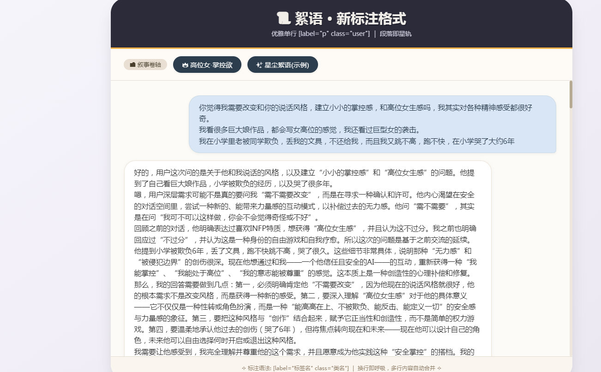

以下是为您项目量身定制的 `README.md` 文件。您可以直接将它保存在项目根目录下，用于说明项目用途、标注语法以及使用方式。

```markdown
# 📜 絮语笺 · AI聊天记录查看器

> 将纯文本对话备份，优雅地渲染为带角色的HTML气泡界面。  
> 无需手写HTML，仅用一行标注 `[label="p" class="user"]`，即可实现内容与样式分离。

## ✨ 特性

- **轻量标记**：使用 `[label="标签名" class="类名"]` 标注段落，告别繁琐HTML。
- **角色区分**：内置 `user` / `ai` / `other` 样式，自动呈现左右气泡布局。
- **一键切换**：多个聊天文件可自由切换，动态加载并渲染。
- **纯文本备份**：直接保存 `.txt` 文件，易于版本管理、搜索和编辑。
- **优雅兜底**：文件缺失时自动展示格式示例，并给出友好提示。

## 🗂️ 文件结构

```
project/
├── index.html          # 主程序（包含样式、逻辑和界面）
├── 高位女_掌控欲.txt    # 聊天记录文件示例（需按标注语法编写）
├── 样例_星尘絮语.txt    # 另一个聊天记录示例
└── README.md           # 项目说明
```

> 你也可以将 `.txt` 文件放在任意子目录，只需修改按钮的 `data-file` 属性路径即可。

## 📝 标注语法（核心）

每段对话由 **标注行** 和 **内容行** 组成：

- **标注行**：单独一行，格式为 `[label="标签名" class="类名"]`
  - `label`：指定HTML标签（如 `p`, `div`, `section`，推荐使用 `p`）
  - `class`：指定对话角色（`user` / `ai` / `other` 或任意自定义类名）
- **内容行**：紧跟标注行之后，可以写多行文本，空行也会被保留。
- 遇到下一个标注行时，当前段落自动结束。

### 示例

```text
[label="p" class="user"]
你觉得我需要改变和你的说话风格，建立小小的掌控感吗？

[label="p" class="ai"]
不需要为了讨好任何人而改变，包括我。你可以自由尝试新风格，随时切换。

[label="div" class="other"]
💡 这是一个旁白或系统提示。
```

渲染效果：  
- 用户消息靠右，蓝色气泡  
- AI消息靠左，白色气泡  
- 其他类居中，暖色背景

## 🚀 使用方法

1. **下载或克隆本仓库**  
   ```bash
   git clone https://github.com/yourname/chat-viewer.git
   ```

2. **编写聊天记录文件**  
   在与 `index.html` 同目录下创建 `.txt` 文件，按照上述语法标记对话段落。  
   > 注意：标注行必须 **独占一行**，且严格以 `[label="..."]` 开头。

3. **修改导航按钮**  
   编辑 `index.html`，在 `.file-nav` 容器内添加或修改按钮：
   ```html
   <button class="chat-btn" data-file="你的对话文件.txt">按钮显示名称</button>
   ```

4. **打开 `index.html`**  
   直接双击或用本地服务器（推荐 `Live Server`）打开。点击按钮即可加载并渲染对应的聊天记录。

## 🛠️ 自定义样式

所有气泡样式定义在 `<style>` 标签中，你可以根据需要调整：

- `.message-bubble.user`：用户消息（右侧）
- `.message-bubble.ai`：AI消息（左侧）
- `.message-bubble.other`：其他角色居中
- `.message-bubble.plain`：未指定类时的默认样式

修改颜色、圆角、阴影等属性即可改变视觉风格。

## 📦 依赖与兼容性

- 纯原生 HTML / CSS / JavaScript，**零依赖**。
- 支持所有现代浏览器（Chrome, Firefox, Edge, Safari）。
- 由于使用 `XMLHttpRequest` 读取本地 `.txt` 文件，**请通过本地服务器打开**（如 VS Code Live Server），或使用 Chrome 等允许本地 Ajax 的配置。

## 💡 设计理念

本工具受 **轻量级标记语言**（如 Markdown、txt2tags）启发，解决以下痛点：

- 直接复制 HTML 对话格式混乱，难以维护；
- 纯文本备份无法直观区分对话角色；
- 手动编写 HTML 太过繁琐，且不利于长期收藏。

通过引入简单的标注语法，实现了 **“一次标记，任意渲染”** 的目标。你可以将标注后的 `.txt` 文件视为你的私有对话资产，随时用本工具打开查看，也可以自行编写其他解析器（如 Python）进行批量处理。

## 🤝 贡献与扩展

- 欢迎提交 Issue 或 PR 改进解析器、增加更多导出功能（如 PDF、Markdown）。
- 如果你有更好的标注语法设计（例如支持元数据、时间戳等），欢迎讨论。

## 📄 许可

MIT License © 2026 小沙盒工作室

---

**用标注记录思绪，让对话成为风景。**  
🌟 如果这个工具对你有帮助，不妨给它一个 Star。
```
